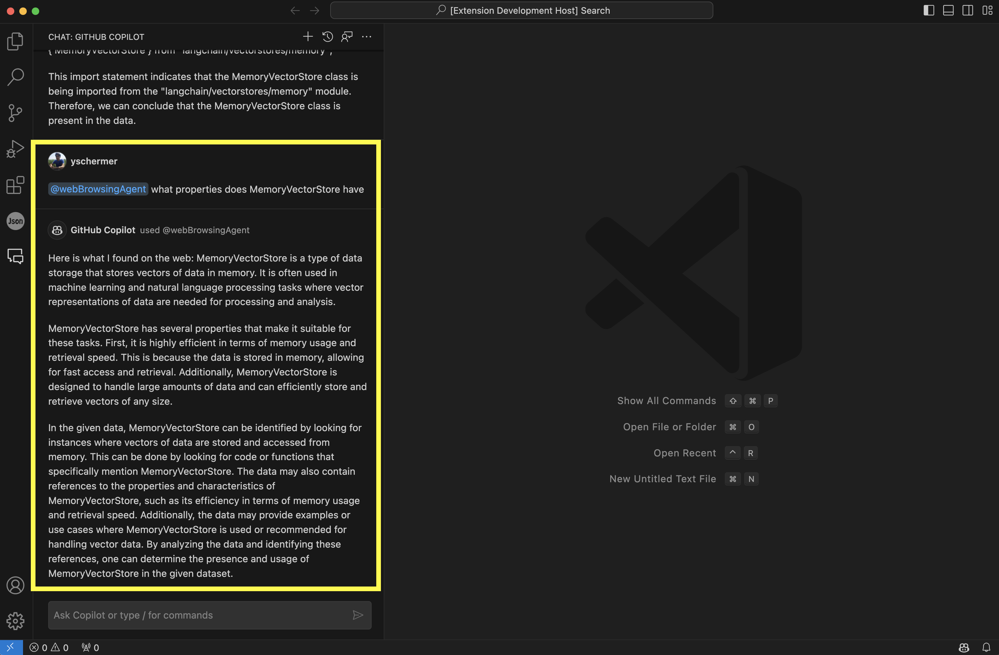

# README

A simple implementation of an agent which can make websearches through Github Copilot. Useful for adding context from the web to the chat window so Copilot can answer follow-up questions more effectively. An example use case would be asking Copilot to look up API docs of new libraries or packages it does not know of. Subsequently, you can ask in-depth questions related to that.



Underlying process is as follows. Websearches are performed via Google Search (SerpApi). 
Subsequently, the HTML of the top links are vectorized and stored in-memory. Then semantic search is used to find the most relevant chunks within the page for your question/query. 
Finally, a summary is generated from all the relevant chunks and returned to the user via the GC extension.

## Requirements

- Only works in VSCode Insiders

Tested on Node `v18.18.2`

## Getting Started

Create a `.env` file based on `.env-example` and add necessary API keys.


Install dependencies
```
npm install
```

Compile TS to JS
```
npm run compile
```


Subsequently, Run and Debug.

## TODO

- [ ] Add markdown for code

